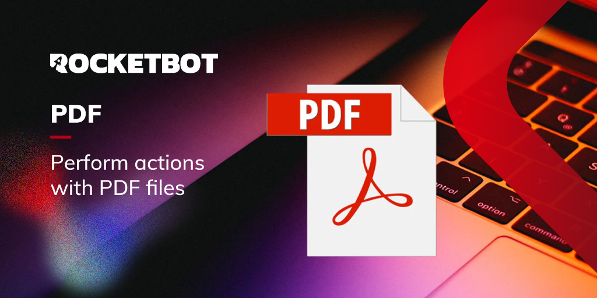

# PDF
  
Módulo para realizar acciones con archivos PDF  

*Read this in other languages: [English](Manual_PDF.md), [Português](Manual_PDF.pr.md), [Español](Manual_PDF.es.md)*
  

## Como instalar este módulo
  
Para instalar el módulo en Rocketbot Studio, se puede hacer de dos formas:
1. Manual: __Descargar__ el archivo .zip y descomprimirlo en la carpeta modules. El nombre de la carpeta debe ser el mismo al del módulo y dentro debe tener los siguientes archivos y carpetas: \__init__.py, package.json, docs, example y libs. Si tiene abierta la aplicación, refresca el navegador para poder utilizar el nuevo modulo.
2. Automática: Al ingresar a Rocketbot Studio sobre el margen derecho encontrara la sección de **Addons**, seleccionar **Install Mods**, buscar el modulo deseado y presionar install.  

## Descripción de los comandos

### Dividir PDF
  
Este comando permite dividir un archivo PDF en varios archivos PDF con cierto número de páginas.
|Parámetros|Descripción|ejemplo|
| --- | --- | --- |
|PDF de entrada|Ruta donde se encuentra el archivo PDF que se desea dividir.|C:/Users/User/Downloads/sample.pdf|
|Ruta de la carpeta donde guardar los PDF resultantes|Ruta que se desea usar para guardar los PDF resultantes.|C:/Users/User/Desktop/PDF|
|Cada cuantas páginas dividir el PDF|Número que se usará para saber cada cuantas páginas se dividirá el PDF.|1|

### Dividir PDF en páginas específicas
  
Divide un PDF en un paso específico.
|Parámetros|Descripción|ejemplo|
| --- | --- | --- |
|Ruta al PDF|Ruta al PDF que deseas dividir.|C:/Users/User/Downloads/sample.pdf|
|Ruta de la carpeta donde guardar el PDF|Ruta que se desea usar para guardar los PDF resultantes.|C:/Users/User/Desktop/PDF|
|Como dividr el PDF|Forma en la cual se desea dividir el PDF.|['1-3', '4-5']|

### Combinar PDFs
  
Este comando permite combinar varios PDFs de una carpeta en un único PDF.
|Parámetros|Descripción|ejemplo|
| --- | --- | --- |
|Ruta de la carpeta con los pdfs|Ruta que contiene todos los PDFs a combinar.|C:/Users/User/Desktop/PDF|
|Ruta del archivo donde guardar el PDF|Ruta que se desea usar para guardar el PDF resultante.|C:/Users/User/Desktop/PDF/merge.pdf|

### Encriptar PDF
  
Este comando permite agregar una contraseña a un archivo PDF.
|Parámetros|Descripción|ejemplo|
| --- | --- | --- |
|PDF a encriptar|Ruta que contiene el PDF para encriptar.|C:/Users/User/Downloads/sample.pdf|
|Path y nombre del archivo donde guardar el PDF encriptado|Ruta que se desea usar para guardar el PDF resultante.|C:/Users/User/Downloads/sample.pdf|
|Clave|Clave que tendrá el PDF encriptado.|s3cr3t-p4ss|

### Desencriptar PDF
  
Este comando permite desencriptar un archivo PDF.
|Parámetros|Descripción|ejemplo|
| --- | --- | --- |
|PDF encriptado|Ruta donde se encuentra el PDF encriptado.|C:/Users/User/Downloads/sample.pdf|
|Clave|Clave para desencriptar el PDF.|s3cr3t-p4ss|
|Guardar PDF desencriptado|Ruta donde guardará el PDF desencriptado.|C:/Users/User/Downloads/output.pdf|

### Leer PDF
  
Este comando permite leer un PDF. Si el PDF esta encriptado, proporcionando la contraseña lo desencripta.
|Parámetros|Descripción|ejemplo|
| --- | --- | --- |
|PDF a leer|Ruta donde se encuentra el PDF.|C:/Users/User/Downloads/sample.pdf|
|Clave|Clave que se usará para desencriptar.|s3cr3t-p4ss|
|Asignar resultado a la variable|Variable para guardar el resultado de la lectura del PDF.|pdf_leido|

### Leer cajas de texto y casillas de verificación de PDF
  
Este comando lee las cajas de texto y casillas de verificación de un archivo PDF.
|Parámetros|Descripción|ejemplo|
| --- | --- | --- |
|Ruta del PDF|Ruta donde se encuentra el archivo PDF que se desea leer.|C:/Users/User/Downloads/sample.pdf|
|Variable donde se almacenará el resultado|Variable donde se almacenará el resultado de la lectura del PDF.|resultado|

### Escribir en input de PDF
  
Este comando permite escribir en un input de PDF, creando un nuevo PDF con los datos cargados.
|Parámetros|Descripción|ejemplo|
| --- | --- | --- |
|Ruta del PDF|Ruta donde se encuentra el archivo PDF que se desea leer.|C:/Users/User/Downloads/sample.pdf|
|Diccionario de inputs|Diccionario de inputs del PDF.|{key1:valor1, key2:valor2}|
|Nombre del PDF con los datos cargados|Nombre y ruta del PDF que se creará con los datos cargados.|C:/Users/User/Downloads/result.pdf|

### Recortar imagen desde PDF
  
Crea una imagen desde las coordenadas asignadas.
|Parámetros|Descripción|ejemplo|
| --- | --- | --- |
|PDF de entrada|Archivo PDF que será utilizado en el módulo|archivo.pdf|
|Imagen JPG|Ruta y nombre que tendrá la imagen JPG extraída del PDF|path/imagen.jpg|
|Página|Número de página del PDF desde donde será obtenida la imagen|3|
|Coordenadas de Inicio|Coordenadas desde donde se obtendrá la imagen|0,0|
|Coordenadas de Fin|Coordenadas hasta donde se obtendrá la imagen|1000,1000|
|DPI|DPI o Puntos por pulgada que tendrá la imagen. Por defecto son 150 DPI|150|

### Convertir a JPG
  
Convierte cada hoja de un archivo PDF a formato JPG
|Parámetros|Descripción|ejemplo|
| --- | --- | --- |
|PDF de entrada|Ubicación de la carpeta donde se encuentra el PDF a convertir a JPG|archivo.pdf|
|Ruta y nombre del archivo JPG a guardar|Ubicación y nombre del archivo JPG que se guardará. Si el PDF contiene más de una hoja, se añadirá el numero de hoja a los archivos|C:/Users/User/Desktop/imagen.jpg|
|Ancho de imagen|Valor numérico que representará el ancho de la imagen en píxeles.|1500|
|DPI|DPI o Puntos por pulgada que tendrá la imagen. Por defecto son 150 DPI|150|
|Resultado|Variable donde será almacenado True o False dependiendo si el módulo pudo ejecutar la acción|variable|

### Agregar imagen a PDF
  
Agrega una imagen a un PDF en la página y coordenadas ingresadas.
|Parámetros|Descripción|ejemplo|
| --- | --- | --- |
|PDF de entrada|Archivo PDF al que se le añadirá la imagen|archivo.pdf|
|archivo JPG|Archivo JPG que será agregado al PDF|path/imagen.jpg|
|Página|Número de página del PDF donde será agregada la imagen|3|
|Coordenadas|Coordenadas de la página del PDF donde se colocará la imagen. Si se colocan coordenadas más altas que el tamaño de la página, la imagen no se podrá visualizar.|150,340|
|PDF de salida|Ubicación del archivo PDF generado con la nueva imagen|path/nuevo_archivo.pdf|
|Resultado|Variable donde será almacenado True o False dependiendo si el módulo pudo ejecutar la acción|variable|
